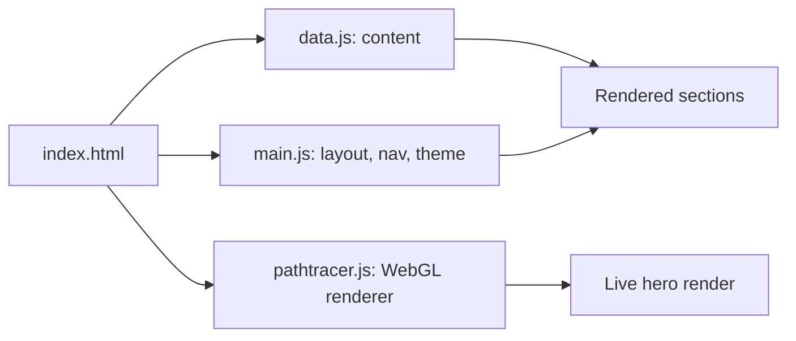

# Portfolio

> Personal portfolio site with a physically based path tracer rendering live in the browser as the hero visual, built in vanilla JS and Three.js.

**[Source](https://github.com/makkergauri/portfolio)**

---

## The problem

Most portfolio sites either use a static template or bolt on generic animations that have nothing to do with the person's actual work. For a computer vision and rendering portfolio specifically, a decorative hero image undersells the point — the more honest signal is a renderer that's actually running, live, on the page.

## Approach

The hero section runs a small path tracer directly in the browser using Three.js and WebGL, so the first thing a visitor sees is real rendering work rather than a static image. The rest of the site (About, Experience, Projects, Notes, Contact) is plain HTML/CSS/JS with content driven from a single data file, so new projects or notes can be added without touching layout code. Theme (light/dark) is resolved before paint via a small inline script to avoid a flash of the wrong theme, and a radar-style nav tracks scroll position across sections.



## Results

| Metric | Value | How it was measured |
|---|---|---|
| Path tracer samples/sec | TBD | Mean over N frames on [hardware/browser] |
| Page load time | TBD | Lighthouse / DevTools, [connection speed] |


**Limitations:** path tracer performance depends on the visitor's GPU and browser; older devices may render at a lower sample count or fall back to a static frame.

## Tech stack

HTML, CSS, JavaScript, Three.js (WebGL), Google Fonts.

## Running it

```bash
git clone https://github.com/makkergauri/portfolio.git
cd portfolio
# serve locally, e.g.:
python -m http.server 8000
```

Requires a local server (not `file://`) since the page loads Three.js from a CDN and uses WebGL. Needs an internet connection for the CDN script and fonts.

## My role

Solo project. Designed and built independently — layout, styling, content structure, and the WebGL path tracer running in the hero section.
